[](https://www.npmjs.com/package/agent-lease)
[](https://github.com/chidev/agent-lease)
[](LICENSE)
[](https://kinglystudio.ai)

```
                            _        _
   __ _  __ _  ___ _ __   _| |_     | | ___  __ _ ___  ___
  / _` |/ _` |/ _ \ '_ \ |_   _|____| |/ _ \/ _` / __|/ _ \
 | (_| | (_| |  __/ | | |  |_|_____|_|  __/ (_| \__ \  __/
  \__,_|\__, |\___|_| |_|            |_|\___|\__,_|___/\___|
        |___/

   🔒 Git hooks that FORCE validation. No escape.
```

**Git hooks that FORCE validation. No broken code reaches CI.**

---

## Why Not husky/lefthook?

| Feature | husky | lefthook | agent-lease |
|---------|-------|----------|-------------|
| Runs validation | During commit | During commit | **BEFORE commit (gate)** |
| Can forget? | Yes | Yes | **No — lock persists** |
| Audit trail | None | None | **Lock files + git trailers** |
| Agentic runners | No | No | **Yes — pipe to any LLM** |
| Model cascading | No | No | **Fast on commit, deep on push** |
| Template vars | No | No | **{{diff}}, {{files}}, {{branch}}** |
| HITL gates | No | No | **Yes — human review before push** |
| Phase support | Limited | Yes | **commit / push / both** |

---

## How It Works

```mermaid
flowchart TD
    A["$ git commit -m 'my changes'"] --> B["🔒 LOCK CREATED"]
    B --> C["❌ COMMIT BLOCKED"]
    C --> D["$ npx agent-lease release --audit-proof"]
    D --> E["⚡ RUNNERS EXECUTE<br/>build → lint → AI review"]
    E --> F{All pass?}
    F -->|Yes| G["✅ Lock stamped<br/>AUDIT_PROOF_PASSED"]
    F -->|No| H["Fix errors"] --> D
    G --> I["$ git commit -m 'my changes'"]
    I --> J["✅ COMMIT SUCCEEDS<br/>proof verified, lock archived"]
```



---

## Quick Start

```bash
# Install
npm install -g agent-lease

# Initialize hooks
npx agent-lease init

# Try to commit (creates lock, blocks)
git commit -m "my changes"

# Run validation to release
npx agent-lease release --audit-proof

# Commit again (succeeds with proof)
git commit -m "my changes"
```

---

## Agentic Runners: AI Code Review on Every Commit

The killer feature. Pipe your diff to **any LLM CLI**.

Contract: `exit 0 = pass, exit 1 = fail, stdout = review text`

### Claude

```json
{
  "runners": [
    { "name": "haiku", "command": "claude -p 'Quick bug check: {{diff}}'", "on": "commit" },
    { "name": "opus", "command": "claude --model opus -p 'Deep security review: {{diff}}'", "on": "push" }
  ]
}
```

### OpenAI Codex

```json
{
  "runners": [
    { "name": "codex", "command": "codex -q 'Check this code: {{diff}}'", "on": "commit" }
  ]
}
```

### Local Ollama

```json
{
  "runners": [
    { "name": "llama", "command": "ollama run llama3 'Audit: {{diff}}'", "on": "commit" }
  ]
}
```

---

## Model Cascading: Fast + Thorough

```mermaid
graph LR
    subgraph COMMIT["COMMIT PHASE • ~5s • every commit"]
        B[build] --> Li[lint] --> H["haiku / gpt-3.5"]
    end
    subgraph PUSH["PUSH PHASE • ~15s • before push"]
        T[tests] --> O["opus / gpt-4"]
    end
    COMMIT -.->|"fast feedback"| PUSH
```



**Config:**
```json
{
  "runners": [
    { "name": "build", "command": "npm run build", "on": "commit" },
    { "name": "lint", "command": "npm run lint", "on": "commit" },
    { "name": "haiku", "command": "claude -p 'Quick check: {{diff}}'", "on": "commit" },
    { "name": "test", "command": "npm test", "on": "push" },
    { "name": "opus", "command": "claude --model opus -p 'Deep review: {{diff}}'", "on": "push" }
  ]
}
```

Fast feedback on commit. Deep review on push. Constant AI coverage without slowing you down.

---

## Audit Trail: Proof of Validation

Every commit gets proof via **git trailers**:

```
commit a1b2c3d
Author: you@example.com
Date:   Mon Feb 3 2026 14:00:00

    Add authentication module

    agent-lease-proof: PASSED
    agent-lease-duration: 5.2s
    agent-lease-runners: build,lint,haiku
```

Query your validation history:
```bash
# All validated commits
git log --grep="agent-lease-proof: PASSED"

# Validation times
git log --format="%s %b" | grep "agent-lease-duration"
```

---

## Template Variables

Commands can use rich git context:

| Variable | Value | Example |
|----------|-------|---------|
| `{{diff}}` | Staged changes (commit) or full diff (push) | `git diff --cached` |
| `{{files}}` | Changed file paths | `src/auth.ts src/user.ts` |
| `{{project}}` | Project name | `my-app` |
| `{{branch}}` | Current branch | `feature/add-auth` |
| `{{hash}}` | Commit hash | `a1b2c3d` |

**Example:**
```json
{
  "name": "contextual-review",
  "command": "claude -p 'Review {{project}} branch {{branch}}: {{diff}}'",
  "on": "push"
}
```

---

## Configuration

`.agent-lease.json`:

```json
{
  "runners": [
    { "name": "build", "command": "npm run build", "on": "commit" },
    { "name": "lint", "command": "npm run lint", "on": "commit" },
    { "name": "test", "command": "npm test", "on": "push" },
    { "name": "review", "command": "claude -p 'Review: {{diff}}'", "on": "push" }
  ],
  "lockDir": "auto",
  "projectName": "my-project"
}
```

### Lock Storage (XDG-compliant)

| Value | Location |
|-------|----------|
| `"auto"` | `$XDG_RUNTIME_DIR/agent-lease/` or `/tmp` |
| `"local"` | `.agent-lease/locks/` (project-local) |
| `"xdg"` | `$XDG_RUNTIME_DIR/agent-lease/` |
| `"/path"` | Any absolute path |

### Environment Overrides

```bash
export AGENT_LEASE_LOCK_DIR=/custom/locks
export AGENT_LEASE_PROJECT=my-project
export AGENT_LEASE_RUNNERS="build:npm run build,lint:npm run lint"
```

---

## CLI Reference

```bash
agent-lease init                              # Install hooks
agent-lease release --audit-proof             # Run commit runners, release lock
agent-lease release --audit-proof --phase push  # Run push runners
agent-lease status                            # Check lock state
agent-lease runners                           # List configured runners
agent-lease clear                             # Remove stale locks
```

---

## For AI Agents

AI coding agents (Claude, Codex, etc.) work seamlessly with agent-lease. **No special prompting required.**

The agent attempts a commit, sees the blocked message with clear instructions, runs the validation command, fixes any failures, and retries. The hook output is self-documenting:

```
╔══════════════════════════════════════════════════════════════╗
║  🔒 AGENT-LEASE: COMMIT BLOCKED                              ║
╠══════════════════════════════════════════════════════════════╣
║  Validation required before commit can proceed.              ║
╚══════════════════════════════════════════════════════════════╝

To release, run validation:

  npx agent-lease release --audit-proof

Then commit again:

  git commit -m "your message"
```

The agent reads this, runs the command, handles failures, and retries. **No human intervention needed.**

### Agent Protocol

1. Agent attempts commit → blocked by hook
2. Agent sees instructions in output
3. Agent runs `npx agent-lease release --audit-proof`
4. If failures → agent fixes and reruns
5. Commit succeeds with proof trailers

See [docs/GUIDE.md](docs/GUIDE.md) for advanced agent integration.

---

## Testing

```bash
npm test
```

Runs 23 E2E + stress tests covering lock/lease/runner cycle in isolated git repos.

---

## Why Lock/Lease?

Other tools run validation **during** the commit. agent-lease is different:

1. **First commit creates a lock** and blocks
2. **You must explicitly run validation** to release
3. **Second commit checks for proof** and proceeds

This **forces** the step. No accidents. No "I'll fix it later." No `--no-verify`.

---

## Links

- **GitHub:** [github.com/chidev/agent-lease](https://github.com/chidev/agent-lease)
- **Issues:** [github.com/chidev/agent-lease/issues](https://github.com/chidev/agent-lease/issues)
- **Sponsor:** [kinglystudio.ai](https://kinglystudio.ai)
- **Ecosystem:** [github.com/lev-os](https://github.com/lev-os)

---

## License

MIT
