[](https://www.npmjs.com/package/agent-lease)
[](https://github.com/chidev/agent-lease)
[](LICENSE)
[](https://kinglystudio.ai)

```
                            _        _
   __ _  __ _  ___ _ __   _| |_     | | ___  __ _ ___  ___
  / _` |/ _` |/ _ \ '_ \ |_   _|____| |/ _ \/ _` / __|/ _ \
 | (_| | (_| |  __/ | | |  |_|_____|_|  __/ (_| \__ \  __/
  \__,_|\__, |\___|_| |_|            |_|\___|\__,_|___/\___|
        |___/

   🔒 Git hooks that FORCE validation. No escape.
```

---

## The Cycle

Here's the cycle you know too well:

- You're agent makes changes
- You forget to check if docs are updated
- You forget to check if it's in alignment with the spec
- Your CTO vibe codes on the weekend
- His prototypes are trash
- But now he wants you to be a 10x dev
- You commit and push
- Next developer does the same thing
- You feel dumb
- They feel dumb
- Repeat

Or worse, some obscure bug makes it to prod.

**The cost isn't just emotional. It's time.** CI cycles take minutes. Deploy rollbacks take longer. Broken deploys on Friday afternoon? Career-limiting.

Luck? That's what brought you here.

---

## The Lock/Lease Pattern

Borrowed from distributed systems:

### First commit attempt:

1. Pre-commit hook detects no validation proof
2. Creates lock file
3. **BLOCKS THE COMMIT**

### Agent runs validation:

1. Runs `npx agent-lease release --audit-proof`
2. Stamps lock file with proof + timestamp

### Second commit attempt:

1. Hook sees valid proof → allows commit
2. Archives proof to `.agent-lease/proofs/`

**No accidents. No bypassing.**

```mermaid
flowchart TD
    A["$ git commit"] --> B["🔒 LOCK CREATED"]
    B --> C["❌ BLOCKED"]
    C --> D["$ npx agent-lease release --audit-proof"]
    D --> E["⚡ RUNNERS EXECUTE"]
    E --> F{All pass?}
    F -->|Yes| G["✅ Proof stamped"]
    F -->|No| H["Fix errors"] --> D
    G --> I["$ git commit"]
    I --> J["✅ COMMITTED with trailers"]
```



---

## Agentic Runners: AI Code Review on Every Commit

Pipe your diff into **any LLM CLI**. The contract: `exit 0 = pass, exit 1 = fail`.

### Model Cascading

| Phase | Model | Purpose |
|-------|-------|---------|
| Commit | Haiku/GPT-3.5 | Fast feedback, obvious bugs |
| Push | Opus/GPT-4 | Deep security/correctness analysis |

```json
{
  "runners": [
    { "name": "build", "command": "npm run build", "on": "commit" },
    { "name": "haiku", "command": "claude -p 'Quick check: {{diff}}'", "on": "commit" },
    { "name": "opus", "command": "claude --model opus -p 'Deep review: {{diff}}'", "on": "push" }
  ]
}
```

---

## Why This Works

- **LLMs catch different bugs than linters** — Type errors vs logic errors
- **Fast models are cheap** — ~$0.001 per commit
- **Can't bypass it** — The lock forces the step
- **It learns your patterns** — Same model reviews consistently

Most of this should be handled in the planning phases - but context window limits and the fact that models are goal driven mean they will compress goals.

We want **constraints**. As deterministic as possible. This is about as close as you're going to get without a custom harness.

The real benefit is that you're not just prompting "follow these standards" over and over with slash commands and hoping skills load. **This is deterministic.** It will -always- say "hey, did you do all this crap I asked you to do?"

---

## Agent-Native Design

```
You: "Add auth to the user service"
Claude: *makes changes*
You: "Commit this"
Claude: *sees agent-lease lock*
Claude: *runs validation, releases lock*
Claude: "Committed with validation proof. Build and ESLint passed."
```

The agent thinks "oh shit, forgot to build" **for you**.

**Key insight:** When humans write code, we rely on discipline. When agents write code, we can program the discipline into the workflow.

### v3.2: Agent Proof Submission

Agents can now submit their own validation proof:

```bash
# Agent runs validators, then submits proof
npx agent-lease release --audit-proof='## Validation Report
Runner: test
Status: PASS
Output: 23 tests passed in 4.2s

Runner: haiku-review
Status: PASS
Output: No critical issues found

Summary: All validations passed. Safe to commit.'
```

The hook output is a **meta-prompt** that teaches the agent exactly how to validate:

```
╔═══════════════════════════════════════════════════════════════════╗
║  🔒 AGENT-LEASE: COMMIT BLOCKED                                   ║
╠═══════════════════════════════════════════════════════════════════╣
║  Validate your changes and submit proof before committing.        ║
╚═══════════════════════════════════════════════════════════════════╝

CONFIGURED RUNNERS:
  test          npm test                              [commit]
  haiku-review  claude -p '...'                       [commit]

CALLBACK FORMAT:
  npx agent-lease release --audit-proof='<YOUR PROOF>'

PROOF TEMPLATE:
  ## Validation Report
  Runner: <name>
  Status: PASS | FAIL
  Output: <output summary>
  ...
  Summary: <your assessment>
```

---

## LLM Steering (v3.2)

For structured LLM output, use steering markers:

```json
{
  "name": "haiku-review",
  "command": "claude -p 'Review diff. Respond ONLY:\n<AGENT_LEASE_START>\nVERDICT: PASS | FAIL\nCRITICAL: 0\nFINDINGS:\n- <issue>\nSUMMARY: <one line>\n<AGENT_LEASE_END>\n\nDiff:\n{{diff}}'",
  "on": "commit",
  "llm": true
}
```

agent-lease parses the structured output and determines pass/fail from the VERDICT.

---

## Observability

Every commit has proof of validation in `.agent-lease/proofs/`:

```json
{
  "timestamp": "2026-02-02T14:00:15Z",
  "phase": "commit",
  "proofMode": "agent",
  "runners": [
    { "name": "test", "status": "PASS", "output": "23 tests passed" },
    { "name": "haiku-review", "status": "PASS", "output": "No issues" }
  ],
  "summary": "All validations passed. Safe to commit."
}
```

And git trailers on every commit:

```
commit a1b2c3d

    Add authentication module

    agent-lease-proof: test:PASS haiku-review:PASS
    agent-lease-agent-summary: All validations passed. Safe to commit.
    agent-lease-llm-findings: Minor: consider null check on line 42
    agent-lease-report: commit-a1b2c3d.json
```

**Measure it. Optimize it.** If validation takes too long, devs will bypass it.

---

## Quick Start

```bash
# Install
npm install -g agent-lease

# Initialize hooks
npx agent-lease init

# Try to commit (creates lock, blocks)
git commit -m "my changes"

# Run validation to release
npx agent-lease release --audit-proof

# Commit again (succeeds with proof)
git commit -m "my changes"
```

---

## Using with Husky

All of this can be done with husky. We just like a dedicated tool. Here's how to wire it up:

```bash
# Install husky
npm install -D husky
npx husky init
```

**`.husky/pre-commit`:**
```bash
#!/bin/bash
# Delegate to agent-lease
exec < /dev/tty
npx agent-lease status --phase commit
if [ $? -ne 0 ]; then
  echo ""
  echo "🔒 Run: npx agent-lease release --audit-proof"
  echo ""
  exit 1
fi
```

**`.husky/pre-push`:**
```bash
#!/bin/bash
exec < /dev/tty
npx agent-lease status --phase push
if [ $? -ne 0 ]; then
  echo ""
  echo "🔒 Run: npx agent-lease release --audit-proof --phase push"
  echo ""
  exit 1
fi
```

Or just use `npx agent-lease init` which installs the hooks directly.

---

## Claude Code + ClawdHub

### Install as a Claude Code Skill

agent-lease is available on [ClawdHub](https://clawhub.ai) — the public skill registry for Claude Code. Install it as a skill so your agent always knows how to use it:

```bash
# Install agent-lease skill
npx clawdhub@latest install agent-lease

# Or search for validation skills
npx clawdhub@latest search "validation"
```

Once installed, Claude Code agents automatically understand the lock/lease flow. The skill teaches the agent:
- How to read the blocked meta-prompt
- How to run validators and format proof
- How to submit proof via `--audit-proof='...'`
- When to bypass (and when not to)

### Publish Your Own Runners as Skills

Created a custom LLM reviewer or validation pipeline? Publish it:

```bash
npx clawdhub@latest publish ./my-validation-skill \
  --slug my-validation-skill \
  --version 1.0.0 \
  --tags "validation,agent-lease,code-review"
```

### With Claude Code Hooks

Claude Code CLI has a hooks system you can use for even tighter integration. Some nifty tricks coming in future posts, but agent-lease is the highest leverage validation gate you can set up in a few minutes and start seeing your cortisol levels go down.

```json
// .claude/settings.json
{
  "hooks": {
    "PreToolUse": [
      {
        "matcher": "Bash(git commit*)",
        "hooks": ["npx agent-lease status --phase commit"]
      }
    ]
  }
}
```

### The Ralph Loop

Shout out to [@GeoffreyHuntley](https://x.com/GeoffreyHuntley) - the Ralph Loop is a deterministic way to start getting control over your workflow. Watch his videos.

A more advanced version: put the validation gate **outside** the Ralph loop, leave commit/pre-push as the final boss. My actual setup uses a custom harness in Leviathan (open source meta framework, coming soon) to handle all of these tips/tricks way more deterministically.

You can create a **layered set of gates** all in the service of staying in the agentic flow, and steering more so than blocking.

---

## Configuration

`.agent-lease.json`:

```json
{
  "runners": [
    { "name": "build", "command": "npm run build", "on": "commit" },
    { "name": "lint", "command": "npm run lint", "on": "commit" },
    {
      "name": "haiku-review",
      "command": "claude -p 'Review: {{diff}}'",
      "on": "commit",
      "llm": true
    },
    { "name": "test", "command": "npm test", "on": "push" },
    {
      "name": "opus-review",
      "command": "claude --model opus -p 'Deep review: {{diff}}'",
      "on": "push",
      "llm": true
    }
  ],
  "lockDir": "auto",
  "projectName": "my-project"
}
```

### Template Variables

| Variable | Value |
|----------|-------|
| `{{diff}}` | Staged changes (commit) or full diff (push) |
| `{{files}}` | Changed file paths |
| `{{project}}` | Project name |
| `{{branch}}` | Current branch |
| `{{hash}}` | Commit hash |

### Lock Storage

| Value | Location |
|-------|----------|
| `"auto"` | `$XDG_RUNTIME_DIR/agent-lease/` or `/tmp` |
| `"local"` | `.agent-lease/locks/` (project-local) |

---

## CLI Reference

```bash
agent-lease init                                    # Install hooks
agent-lease release --audit-proof                   # Run runners, release (v2)
agent-lease release --audit-proof='<proof>'         # Accept proof text (v3.2)
agent-lease release --audit-proof --phase push      # Push phase
agent-lease status                                  # Check lock state
agent-lease runners                                 # List configured runners
agent-lease clear                                   # Remove stale locks
```

---

## Why Lock/Lease?

Other tools run validation **during** the commit. agent-lease is different:

1. **First commit creates a lock** and blocks
2. **You must explicitly run validation** to release
3. **Second commit checks for proof** and proceeds

This **forces** the step. No accidents. No "I'll fix it later." No `--no-verify`.

---

## Get Started

```bash
npm install -g agent-lease
npx agent-lease init
```

- **GitHub:** [github.com/chidev/agent-lease](https://github.com/chidev/agent-lease)
- **ClawdHub:** [clawhub.ai](https://clawhub.ai)
- **Sponsor:** [kinglystudio.ai](https://kinglystudio.ai)

---

## License

MIT
